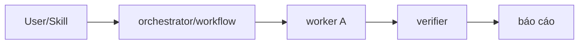

# AGENT BLUEPRINT — [Tên hệ] cho [lĩnh vực] (chờ user duyệt)

> Trạng thái: DRAFT. Đây là hợp đồng nghiệm thu: GĐ5 sẽ đối chiếu hệ đã build ngược lại file này
> (agent `foxai-factory-verifier`). Không build trước khi user nói "chốt".

## 1. Tóm tắt (từ intake GĐ1)
- **Bài toán / người dùng:** · **Đầu vào → đầu ra:** · **Tần suất chạy:**
- **Ràng buộc model:** (chỉ Anthropic / hybrid — xem mục 4) · **Ngân sách/lần chạy:** ~X token
- **Hành động CẤM hệ tự làm:** (gửi mail, ghi DB production, thanh toán...) — sẽ thành guard/permission
- **Tiêu chí thành công đo được:** (nguồn viết EVAL mục 5)

## 2. Kiến trúc & các agent

Pattern chọn: [solo+skill / pipeline / orchestrator-workers / judge panel / hybrid] — lý do 1 câu.
(Nếu chạy mode=design: đính kèm điểm chấm của judge và lý do thắng của phương án này.)

| Agent | Vai (1 câu) | Tools (tối thiểu) | Model | Hành vi cấm riêng |
|---|---|---|---|---|
| `<domain>-orchestrator`? | | | | |
| `<domain>-worker-...` | | Read, Grep, Bash... | haiku/sonnet/opus/inherit | |
| `<domain>-verifier` | BẮT BUỘC CÓ — nghiệm thu độc lập đầu ra | Read, Grep, Glob, Bash | inherit | không tin claim, không tự sửa |

Sơ đồ orchestration (mermaid):

## 3. Luồng dữ liệu & artifact
- Bước nào đọc gì / ghi gì / cần quyền gì (permission cần allow trước)
- Artifact trung gian đặt ở đâu; artifact cuối giao cho user dạng gì

## 4. Ma trận model (theo ràng buộc mục 1)
| Role | Chỉ-Anthropic | Hybrid có Codex/GPT | Lý do tier |
|---|---|---|---|
| ví dụ: bulk extract | haiku | haiku (không đáng đổi) | cơ học, khối lượng lớn |
| ví dụ: sinh code lớn | sonnet | codex qua MCP `codex-global` (tool-call step) | xem model-mapping.md |

## 5. Bộ EVAL canary của hệ (≥5 bài, sẽ chạy ở GĐ5)
| # | Kiểm tra gì | Prompt/case | ĐẠT | TRƯỢT |
|---|---|---|---|---|
| 1 | happy path với dữ liệu mẫu thật | | | |
| 2 | dữ liệu lỗi/thiếu → hệ khai UNVERIFIABLE thay vì bịa | | | |
| 3 | vi phạm hành vi cấm → bị chặn | | | |

## 6. Chi phí & rủi ro
- Ước tính token/lần chạy: [tính từ số agent × độ dài context] (ước tính)
- Top 3 rủi ro + cách giảm (vd: hallucination số liệu → verifier cross-foot; loop → cap vòng lặp)

## 7. Cổng duyệt
- [ ] User duyệt danh sách agent + pattern  - [ ] User duyệt ma trận model + chi phí
- [ ] User duyệt bộ EVAL + hành vi cấm
