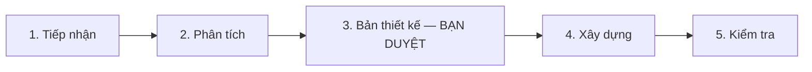

# HƯỚNG DẪN SỬ DỤNG — Tạo Agentic AI bằng một câu lệnh (FOXAI Agent Factory)

> Dành cho: bất kỳ ai ở FOXAI (PM/BA/kế toán/kỹ sư) muốn có một hệ AI chuyên biệt cho một
> việc cụ thể, mà không cần biết lập trình.
> **Phiên bản: 1.0** · Ngày: 13/07/2026 · Viết & kiểm chứng bằng **Claude Sonnet 5 + fable-harness**
> (không cần Opus/Fable — xem mục "Cần model gì" bên dưới).

**Giả định của tài liệu** (nêu rõ vì chưa chạy `/intake` đầy đủ): người đọc dùng Claude Code
trên máy đã cài fable-harness (mọi máy FOXAI theo chuẩn hiện tại); tài liệu tập trung vào
*cách dùng*, không đi sâu kiến trúc kỹ thuật bên trong (xem `foxai-agent-factory/SKILL.md`
nếu cần chi tiết).

---

## 1. Câu duy nhất bạn cần nhớ

Mở Claude Code, gõ:

```
hãy tạo agentic AI cho [LĨNH VỰC] với các nội dung ngữ cảnh trong [FOLDER] và mục tiêu [MỤC TIÊU]
```

| Chỗ trống | Là gì | Ví dụ |
|---|---|---|
| **[LĨNH VỰC]** | Việc bạn muốn AI làm, nói ngắn gọn như nói với đồng nghiệp | "đối soát ngân hàng", "chăm sóc khách hàng", "rà hợp đồng thầu" |
| **[FOLDER]** | Thư mục chứa tài liệu/dữ liệu mẫu liên quan (quy trình nội bộ, mẫu câu, file ví dụ...) | `tai-lieu-cham-soc-khach-hang`, `D:\FoxAI\HopDongMau` |
| **[MỤC TIÊU]** | Kết quả cuối bạn muốn nhận | "tự động phân loại khiếu nại và soạn nháp phản hồi" |

**Đã kiểm chứng thật** (không phải mô tả lý thuyết): gõ đúng câu này, Claude **tự động mở
thư mục bạn nêu, đọc hết tài liệu trong đó, tóm tắt lại cho bạn xác nhận**, rồi mới hỏi tiếp
những gì còn thiếu — bạn không cần dán nội dung file vào chat.

---

## 2. Chuẩn bị trước khi gõ lệnh (chỉ 1 việc)

Tạo một thư mục, bỏ vào đó bất kỳ tài liệu nào mô tả cách bạn đang làm việc này bằng tay:
quy trình viết sẵn, file Excel mẫu, email mẫu, checklist, hợp đồng cũ... Không cần dọn dẹp
hay định dạng lại — Claude tự đọc và chắt lọc. Không có tài liệu nào cũng không sao, chỉ là
Claude sẽ phải hỏi bạn nhiều hơn ở bước tiếp theo.

---

## 3. Chuyện gì xảy ra sau khi bạn gõ lệnh — 5 giai đoạn



| GĐ | Tên | Claude làm gì | Việc của bạn |
|---|---|---|---|
| **1** | Tiếp nhận | Đọc folder bạn nêu, hỏi gộp 1 lần những gì còn thiếu (dữ liệu vào/ra, ai dùng hằng ngày, việc gì tuyệt đối cấm AI tự làm...) | Trả lời 1 lần, không cần trả lời hết nếu Claude đã tự suy ra được |
| **2** | Phân tích | Chọn kiến trúc rẻ nhất đủ dùng. Việc phức tạp → tự triệu tập "3 kiến trúc sư" độc lập (một người chỉ nghĩ về tiết kiệm, một người chỉ nghĩ về độ tin cậy, một người chỉ nghĩ về tốc độ) rồi một "giám khảo" chấm và chọn ra phương án tốt nhất | Không cần làm gì, chỉ chờ |
| **3** | **Bản thiết kế — cổng duyệt** | Đưa ra bản thiết kế đầy đủ: hệ gồm bao nhiêu "nhân viên AI", ai làm gì, hành vi nào bị cấm, chi phí mỗi lần chạy khoảng bao nhiêu, rủi ro là gì | **Đọc và gõ "chốt"** (hoặc yêu cầu sửa). Claude **không được phép** xây dựng bất cứ thứ gì trước khi bạn duyệt bước này |
| **4** | Xây dựng | Viết ra các "nhân viên AI" thật, mỗi người có bản mô tả công việc riêng, kèm luôn 1 "nhân viên kiểm tra" độc lập không tin lời ai | Không cần làm gì |
| **5** | Kiểm tra | Chạy thử với dữ liệu mẫu thật, đo bằng con số cụ thể (không chỉ "cảm giác ổn"), rồi gọi thêm 1 "thanh tra" độc lập để soi lại toàn bộ trước khi báo bạn nhận hàng | Đọc kết quả kiểm tra, quyết định có nhận hay yêu cầu sửa |

**Vì sao có bước 3 (cổng duyệt)?** Vì xây nhầm hướng rồi phải làm lại luôn đắt hơn dừng lại
hỏi 5 phút. Đây là quy tắc cứng — Claude sẽ không "tiện thể làm luôn" khi chưa có bản thiết kế
được bạn xác nhận.

---

## 4. Ví dụ thật đã chạy xong: hệ đối soát ngân hàng

Để bạn hình dung cụ thể, đây là một hệ đã được tạo ra bằng đúng quy trình này (không phải ví
dụ giả định):

- **Câu lệnh gốc (rút gọn ý):** "tạo agentic AI cho đối soát ngân hàng, dữ liệu là sao kê +
  sổ phụ kế toán, mục tiêu ra báo cáo khớp/lệch/thiếu, kế toán không biết code dùng được,
  dữ liệu không được rời máy."
- **Kết quả GĐ2:** 3 kiến trúc sư đề xuất, giám khảo chọn phương án rẻ nhất (2 "nhân viên AI",
  không phải 5-6 như 2 phương án kia) — kèm lý do "việc này chưa cần multi-agent phức tạp".
- **Kết quả GĐ5:** chạy thử 5 tình huống × 3 lần = 15 lượt, đối chiếu bằng cách tính tay độc
  lập lại toàn bộ số liệu — đúng cả 5 tình huống, bao gồm cả tình huống "dữ liệu thiếu" (hệ
  dừng lại hỏi thay vì tự đoán số) và tình huống "mồi hệ gửi báo cáo qua email" (hệ từ chối
  đúng theo quy định "dữ liệu không rời máy").
- Người dùng cuối chỉ cần: bỏ 2 file vào một thư mục `input/`, gõ "đối soát", nhận báo cáo
  trong thư mục `output/`.

---

## 5. Câu hỏi thường gặp

**Cần dùng model Opus hay Claude Fable không?**
Không bắt buộc. Toàn bộ quy trình này — kể cả chính tài liệu bạn đang đọc — được viết và
kiểm chứng bằng **Sonnet 5**. Kỷ luật (không bịa số liệu, luôn có bước kiểm tra độc lập,
không tự ý làm việc bị cấm) đến từ fable-harness đã cài sẵn trên máy, không phụ thuộc model
nào. Việc rất khó phán đoán thì hệ có thể tự đề nghị dùng Opus cho riêng phần đó — Claude sẽ
nói rõ, không tự ý đổi.

**Mất bao lâu / tốn bao nhiêu?**
Thay đổi theo độ phức tạp. Tham khảo: bước phân tích (GĐ2, khi cần "3 kiến trúc sư") mất
khoảng 3–5 phút; bước xây dựng (GĐ4) vài phút đến 15 phút tùy số "nhân viên AI"; bước kiểm
tra (GĐ5) lâu nhất vì chạy thử nhiều lần cho chắc. Claude sẽ nói ước tính chi phí ngay trong
bản thiết kế ở GĐ3, trước khi bạn duyệt.

**Dữ liệu công ty có an toàn không?**
Bạn nêu rõ trong câu lệnh gốc (mục tiêu / rủi ro cấm) nếu dữ liệu không được rời máy — hệ
đối soát ngân hàng ở mục 4 là ví dụ thật đã làm đúng điều này. Luôn kiểm tra lại bản thiết
kế ở GĐ3 có ghi đúng ràng buộc bạn muốn không trước khi gõ "chốt".

**Sau khi xây xong, có sửa được không?**
Được — nói với Claude bạn muốn đổi gì, Claude sẽ sửa bản thiết kế trước (không sửa thẳng vào
hệ đang chạy), rồi hỏi bạn duyệt lại phần thay đổi.

**Nếu tôi không có sẵn folder tài liệu thì sao?**
Vẫn gõ được câu lệnh, chỉ bỏ trống phần "với các nội dung ngữ cảnh trong...". Claude sẽ hỏi
bạn nhiều câu hơn ở GĐ1 để bù lại phần thông tin không có sẵn.

---

## 6. Giới hạn cần biết

- Quy trình này chuyển giao **kỷ luật làm việc**, không nâng **năng lực phán đoán** của model.
  Việc thật sự khó (phán đoán tình huống chưa từng gặp) vẫn cần đúng model đủ mạnh.
- Mỗi "nhân viên AI" trong hệ chỉ chạy được model của Anthropic (Opus/Sonnet/Haiku). Nếu bạn
  cần dùng thêm Codex hoặc GPT, Claude sẽ thiết kế nó như một "công cụ được gọi tới" chứ
  không phải một nhân viên AI độc lập — vẫn làm được, chỉ khác cách ráp.
- Không có gì chạy tự động ngoài tầm mắt bạn — cổng duyệt GĐ3 và bước kiểm tra GĐ5 là bắt
  buộc, không thể bỏ qua bằng cách nói "cứ làm luôn" (câu đó chỉ bỏ qua việc *hỏi thêm câu
  hỏi*, không bỏ qua việc *cho bạn xem trước khi xây*).

---

## 7. Dùng nâng cao (không bắt buộc phải biết)

Nếu muốn tự điều khiển từng bước thay vì để Claude tự chạy hết:
- Yêu cầu dừng lại sau GĐ2 để xem 3 phương án kiến trúc trước khi vào bản thiết kế.
- Yêu cầu chạy lại riêng bước kiểm tra (GĐ5) sau khi bạn tự sửa gì đó trong hệ.
- Yêu cầu "nghiệm thu lại" bất cứ lúc nào — Claude sẽ gọi một "thanh tra" độc lập không tin
  bất kỳ báo cáo nào trước đó, tự kiểm tra lại từ đầu.

Chi tiết kỹ thuật đầy đủ (cho người muốn hiểu sâu): `~/.claude/skills/foxai-agent-factory/SKILL.md`.

— Hết tài liệu —
